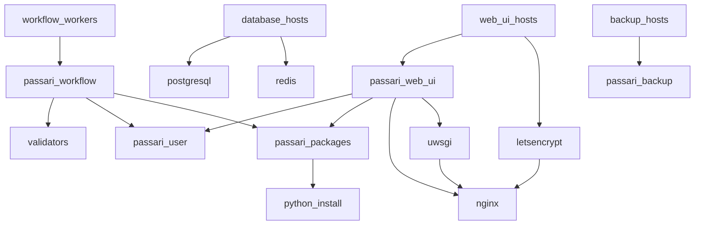

# Passari Ansible

Ansible playbooks to provision AlmaLinux 9 based hosts for system for
digital preservation with Passari.

## Installing Ansible

To get started, install Ansible. On Fedora-based systems such
AlmaLinux, you can run:

    sudo dnf install ansible

On Debian-based systems, you can run:

    sudo apt-get install ansible

You may also install Ansible using Python's Pip package manager and
utilize the provided `requirements.txt` file. Use a separate virtual
environment to avoid conflicts with system packages:

    python3 -m venv .venv
    source .venv/bin/activate
    pip install -r requirements.txt

## Configuration

To configure the Ansible playbooks, you need to create an inventory.
There is an example inventory in `inventory/example` which you can copy
to e.g. `inventory/production` and modify as needed.

The inventory should contain the hosts that you want to provision and
the groups that they belong to. The groups are used to apply roles to
the hosts.

The inventory should also contain the variables that are used to
configure the hosts. The variables are stored in the `group_vars` and
`host_vars` directories.

## Running the Playbooks

When Ansible is installed, you can run the playbook by running:

    ansible-playbook -J -i inventory/YOUR_INVENTORY site.yml

### Testing the Playbooks with a Single Host

It's also possible to test the playbooks with a single host by using
the `inventory/example` inventory and defining the connection settings
in `inventory/example/host_vars/example-host/connection.yml`.  There is
a template file in that directory that you can copy and modify.

To run the playbook with the example inventory, you can run:

    ansible-playbook -i inventory/example site.yml

## SSL certificates

This configuration uses so called dev cert by default.  It's a
self-signed SSL certificate with a "private" key, which is stored
unencrypted to this repository and therefore it's only good for
development purposes.  For production, either enable the Let's Encrypt
with `letsencrypt_enabled` variable or define your custom SSL
certificate via `passari_web_ui_ssl_cert` variable and its key via
`passari_web_ui_ssl_cert_key` variable. (Remember to store the key in an
encrypted vault file.)

### Generating SSL certificate and key

To generate a Certificate Signing Request (CSR) and a corresponding key
use the command:

    openssl req -newkey rsa:2048 -nodes -keyout ssl.key -out ssl.csr

The CN field should have the domain name (FQDN) of the site.

You may check the CSR file contents with:

    openssl req -text -noout < ssl.csr

The key file is usable as is, but the CSR you should send for signing.
When a CA has signed the CSR, they will send you the signed certificate.
If the signed certificate is in PEM format, i.e. a text file that starts
with `-----BEGIN CERTIFICATE-----`, then you can use copy-paste it as-is
to the `settings.yml`. Just add indentation and use YAML's multiline
support.  See the `passari_web_ui_dev_ssl_cert` for an example.  If the
signed cert is in a binary format (usually named *.cer) you may use the
following command to convert it to the PEM text format:

    openssl x509 < ssl.cer > ssl.crt

It's also possible to self-sign the CSR, but that's only good for
testing purposes, since browsers will complain about self-signed certs.
Self-signing the CSR can be done with:

    openssl x509 -signkey ssl.key -req -days 365 < ssl.csr > ssl.crt

## Architecture

The Ansible playbooks are divided into roles which are used to provision
the hosts. The hosts belong to groups which define the roles that are
applied to them.

The host groups are:

- `workflow_workers`
- `web_ui_hosts`
- `database_hosts`
- `backup_hosts`

The roles are:

- `common`: Common packages and settings for all hosts
- `passari_workflow`: Passari Workflow Worker
- `passari_web_ui`: Passari Web User Interface
- `validators`: Installs software used in the SIP validation
- `passari_packages`: Installation packages for the Workflow and Web UI
- `passari_user`: Create the user account for the Passari services
- `python_install`: Provide another Python version (used for Passari)
- `nginx`: Nginx web server for serving the Web UI
- `uwsgi`: uWSGI application server for the Web UI
- `letsencrypt`: Let's Encrypt CertBot for renewing TLS certificates
- `postgresql`: PostgreSQL database for the web UI and Workflow
- `redis`: Redis key-value store for the Workflow Workers
- `passari_backup`: Backup the Passari database

The dependency tree of the host groups and roles is as follows. Note
that the `common` role is applied to all hosts, but it is not shown in
the graph.

